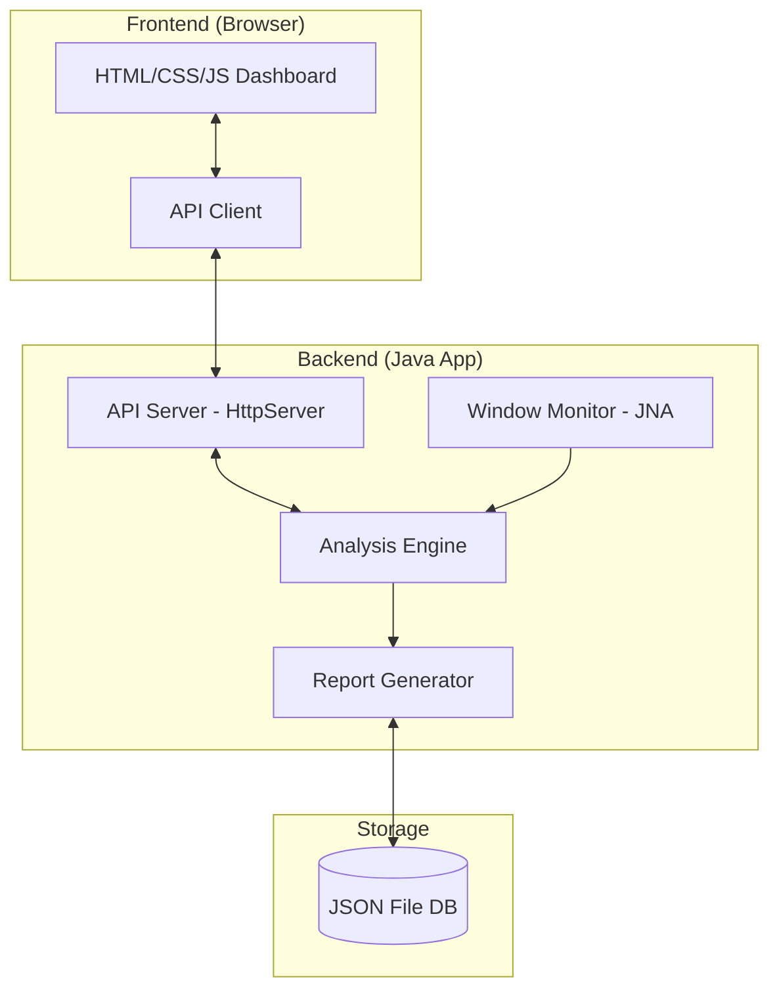
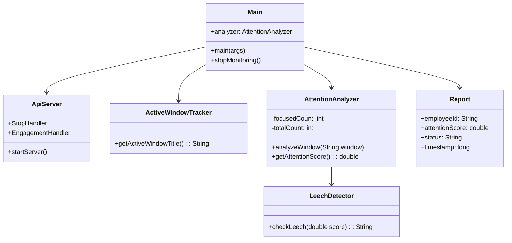

# Project Report: Meeting Leech Detector

## 1. Problem Statement
In the era of remote and hybrid work, virtual meetings have become the primary mode of collaboration. However, a significant challenge emerged: **"Meeting Leeching"**. This occurs when participants join a meeting but remain inactive, multitasking, or completely disengaged from the discussion. 

Traditional monitoring tools are often intrusive (e.g., screen recording or webcam monitoring), which raises privacy concerns. There is a critical need for a **privacy-conscious, lightweight, and real-time system** that can detect engagement levels by analyzing application usage patterns without compromising user privacy.

---

## 2. Objectives
The primary objectives of the Meeting Leech Detector project are:
- **Real-time Monitoring**: Track the active application window of participants during a meeting at regular intervals (10 seconds).
- **Engagement Analysis**: Classify the user's state as "Focused" or "Not Focused" based on the application currently in the foreground.
- **Privacy Preservation**: Only capture window titles, avoiding intrusive screen or video capture.
- **Data Analytics**: Provide a dashboard for managers to view team engagement trends and for employees to track their own performance.
- **Reporting**: Generate and export detailed session reports (CSV/JSON) for administrative review.
- **Automated Detection**: Use predefined thresholds to flag "leeching" behavior automatically.

---

## 3. Tools and Techniques
### **Backend Technologies**
- **Language**: Java (JDK 21+)
- **Library (JNA)**: Java Native Access for interfacing with Windows OS APIs to retrieve foreground window titles.
- **Server**: `com.sun.net.httpserver.HttpServer` for a lightweight RESTful API implementation.
- **Concurrency**: `ScheduledExecutorService` for background tracking tasks.

### **Frontend Technologies**
- **Structure**: HTML5 (Semantic elements)
- **Styling**: CSS3 (Vanilla) with Bootstrap 5 for responsiveness and a "Glassmorphism" aesthetic.
- **Logic**: Vanilla JavaScript (ES6) for API consumption and DOM manipulation.
- **Visualization**: Chart.js for engagement timelines and analytics.

### **Data Management**
- **Storage**: Flat-file JSON database (`reports_db.txt`) for persistent session records.
- **Format**: JSON for data exchange between Backend and Frontend.

---

## 4. Methodology

### 4.1 Implementation Details
The system operates as a client-side background process. Every 10 seconds, the backend captures the title of the active window. This title is passed through an analysis engine that checks for keywords associated with meeting platforms (e.g., "Google Meet", "Zoom", "Teams"). 

The results are served via a local web server (Port 8000), which the frontend dashboard polls to update UI elements like engagement gauges and activity timelines in real-time.

### 4.2 Diagrams

#### **Use Case Diagram**
```mermaid
graph TD
    Employee((Employee))
    Manager((Manager))
    
    subgraph "Meeting Leech Detector"
        UC1(Start/Stop Session)
        UC2(View Personal Dashboard)
        UC3(View Team Analytics)
        UC4(Export Session Reports)
        UC5(Receive Leeching Alerts)
        UC6(Track Window Title)
        UC7(Analyze Focus)
    end
    
    Employee -- UC1
    Employee -- UC2
    Manager -- UC3
    Manager -- UC4
    Manager -- UC5
    UC1 ..> UC6 : <<include>>
    UC6 ..> UC7 : <<include>>
```

#### **Architecture Diagram**


#### **Class Diagram**


### 4.3 Algorithms

#### **1. Window Tracking Algorithm**
1. **Initialize** Scheduler with a fixed period (10 seconds).
2. **On each Tick**:
   - Invoke Windows API via JNA (`User32.INSTANCE.GetForegroundWindow`).
   - Extract the text title of the active window.
   - Send the title to the `AttentionAnalyzer`.
   - Update in-memory activity logs.

#### **2. Focus Classification Logic**
1. **Input**: `windowTitle` (String)
2. **Keywords**: `["Google Meet", "Zoom", "Microsoft Teams", "PowerPoint"]`
3. **Process**:
   - If `windowTitle` contains any keyword: `isFocused = true`
   - Else if `windowTitle` is null or unknown: `isFocused = false`
   - Else: `isFocused = false`
4. **Output**: Boolean focus state.

#### **3. Leech Detection Formula**
The engagement score ($S$) is calculated as:
$$S = \frac{\text{Total Focused Ticks}}{\text{Total Session Ticks}}$$

Status Classification:
- **Engaging**: $S > 0.75$
- **Neutral**: $0.5 \le S \le 0.75$
- **Leeching**: $S < 0.5$

---

## 5. Results and Discussion
The Meeting Leech Detector successfully identifies periods of distraction during virtual sessions. 

### **Key Findings:**
- **Accuracy**: The keyword-based detection effectively identifies active participation in most common meeting platforms.
- **Resource Efficiency**: The background tracking process is extremely lightweight, ensuring it doesn't interfere with the meeting itself.
- **Transparency**: By providing a live timeline, users can see exactly when they lost focus, encouraging better self-regulation.
- **Actionable Data**: Managers can identify which meetings consistently have low engagement, allowing them to optimize meeting structures.

---

## 6. Project Demonstration
The project is designed to run locally, ensuring data remains on the user's machine.

### **Local Setup & Link:**
- **Dashboard URL**: [http://localhost:8000](http://localhost:8000) (Accessible after running the backend)
- **Startup**: Execute `run.bat` in the project root.
- **Demo Features**:
  - **Live Gauge**: Visual feedback on current attention levels.
  - **Engagement History**: Detailed records of past sessions with "Leeching" vs "Engaging" status.
  - **Export Tool**: Downloadable reports for team management.
